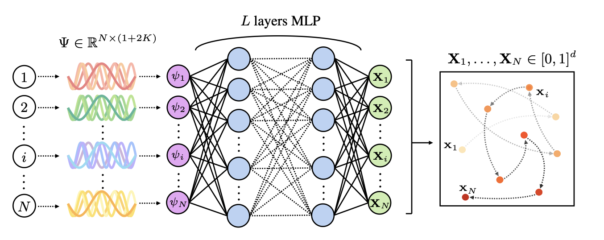

# Neural Low-Discrepancy Sequences
**Authors**: Michael Etienne Van Huffel, Nathan Kirk, Makram Chahine, Daniela Rus, T. Konstantin Rusch


## Overview
This repository contains the code for our ICLR submission *Neural Low-Discrepancy Sequences*. It provides PyTorch implementations for model training, discrepancy-based fine‑tuning, and reproducible experiments.

<p align="center">
  
</p>
Figure: Overview of the NeuroLDS architecture.</em></p>


## Key files & scripts
- `scripts/models.py` — Main model definition (NeuroLDS).
- `scripts/main.py` — Create/generate sequences; trains/evaluates NeuroLDS.
- `scripts/utils.py` — Aid/utility functions (discrepancy losses, seeding, I/O, plotting).
- `scripts/hypertuning.py` — Hyperparameter optimization via Optuna.
- `scripts/smoke_test.sh` — Sanity check; run to verify the setup works end-to-end.

## Installation
```bash
# Recommended: Python 3.10–3.12 (tested on 3.11)
python3.11 -m venv .venv && source .venv/bin/activate
pip install -r requirements.txt
```

## Quick check
Run the smoke test to verify that everything is set up correctly:
```bash
cd scripts
bash smoke_test.sh
```

## License
This project is licensed under the MIT License - see the [LICENSE](LICENSE) file for details.
